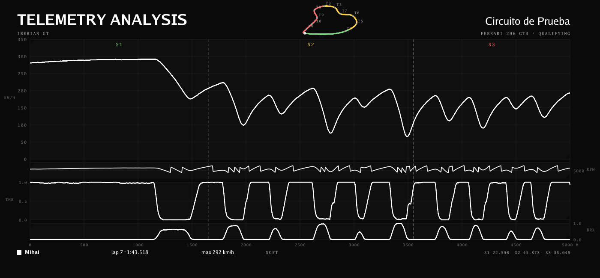
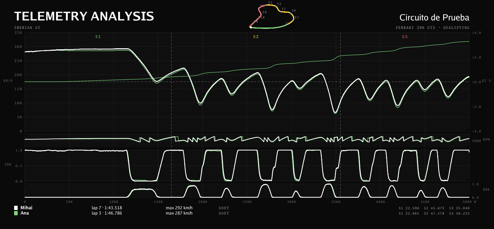

# visual-telemetry

A Pacenote server plugin that draws a lap's telemetry: speed, revs, throttle and brake against
distance, the sectors marked through every panel with their times, the circuit in the corner with
its turns numbered, and a legend with the driver, the lap time, the top speed and the tyre. One chart
per lap. Two to four laps of the team can be overlaid on one chart, with each lap's time against the
first on an axis of its own.

Each chart is a document (SVG) for the pages and a picture (PNG) for sharing, drawn by the same code
in pure Go. It calls nothing outside the machine and spends nothing. The server is not changed for
it: the client posts each lap's trace to this plugin's own address, because a plugin cannot read
the server's stored traces and the client has them at full rate anyway.



Two laps overlaid. The second is drawn in its own colour and its time against the first runs on the
right-hand axis:



Both are modelled laps from the test fixtures; `make samples` redraws them into `docs/`.

## Installing it

```
make dist
cp -R dist/visual-telemetry <the server's>/pacenote-data/plugins/visual-telemetry
```

In the panel: *Look for new plugins*, enable. It needs no key.

## Configuring it

| Setting | |
|---|---|
| **Chart title** | The words across the top. `TELEMETRY ANALYSIS` by default. |
| **Team name** | Under the title. Empty shows nothing. |
| **Team colour** | `#RRGGBB`; the first lap on a chart is drawn in it. The others are white, blue, purple. |
| **Keep laps for** | Days a posted lap is kept. 90 by default; zero keeps them for ever. |

## What a client posts

`POST /plugin/visual-telemetry/laps`, with the device token, at the end of a lap:

```json
{
  "stint_id": "7f0c2e1a-…", "lap": 7, "lap_ms": 84561,
  "session": "qualifying", "track": "Spa-Francorchamps", "car": "Ferrari 296 GT3",
  "track_length_m": 7004, "sectors": [0, 0.265, 0.712], "compound": "SOFT",
  "corners": [{"turn": 1, "apex_pct": 40}, {"turn": 8, "apex_pct": 520}],
  "trace": [{"t": 0, "v": 118, "thr": 100, "brk": 0, "g": 4, "r": 7200, "st": 0, "p": 0, "lg": 2, "og": 10, "la": 505, "lo": 58}, …]
}
```

| Field | | |
|---|---|---|
| `stint_id`, `lap` | required | the server's identifiers, from the upload; together they name the chart |
| `trace` | required | the lap's samples in the protocol's own point shape, 2 to 4 096 of them, each with its distance `p` in thousandths of the lap. GPS (`la`, `lo`) draws the map; without it there is no map |
| `lap_ms` | | the lap time; the last sample stands in without it |
| `track_length_m` | | metres round the circuit; the axis is in thousandths without it |
| `sectors` | | boundaries as fractions of the lap, ascending, the first 0 — the stint's, repeated here |
| `corners` | | turn numbers and their apexes, for the map |
| `session`, `track`, `car`, `compound` | | for the header and the legend |

The answer:

```json
{"lap": "7f0c2e1a-…/7", "points": 1001,
 "svg": "/plugin/visual-telemetry/charts/7f0c2e1a-…/7.svg",
 "png": "/plugin/visual-telemetry/charts/7f0c2e1a-…/7.png"}
```

`400` when the lap cannot be drawn (the body says why), `401` without a driver, `503` without a
database. A lap posted twice replaces itself. Unknown fields are ignored.

## Charts

| Address | Who | What |
|---|---|---|
| `/plugin/visual-telemetry/charts?lap=<stint>/<lap>` | any signed-in driver or an administrator | the chart on a page in the panel's own shell, with the picture to save and the laps to pick from; `lap` two to four times overlays them. Without `lap`, the laps alone |
| `GET /plugin/visual-telemetry/charts/<stint>/<lap>.svg` or `.png` | the same | one lap, the file itself |
| `GET /plugin/visual-telemetry/charts/compare.svg?lap=<stint>/<lap>&lap=…` or `.png` | the same | two to four laps overlaid, the file itself; the first sets the axis and the colour, the others show their time against it |
| `/plugin/visual-telemetry/me` | a driver | their laps, a link to each chart, and a form that overlays the ticked ones |
| `/plugin/visual-telemetry/` | an administrator | everyone's laps, the same form |
| `/plugin/visual-telemetry/style.css` | anyone | the few styles these pages add to the panel's own; a file, because the server's content security policy allows no styling inside a page |

A chart is the team's to look at: the `/charts` route is declared as the plugin's own decision, and
the decision is any signed-in driver or an administrator, nobody else. A picture is 1400 × 650, drawn in the server panel's own style — its ground, its cards, its labels — so it looks like the server drew it.

## Testing it

`make` runs what CI runs; `make test-postgres` and `make cover` need `PACENOTE_TEST_DATABASE_URL`.
`VT_SAMPLE_DIR=/somewhere go test -run TestWriteSampleChart .` writes a sample chart to look at.
`TESTING.md` has the rest: what the suite asserts, what a lap costs to draw, and how to post a lap
to a running server by hand.

## Licence

GNU General Public License, version 3 — see `LICENSE`. Like the server, engineer and voice. The
plugin contract it is built on (`github.com/pacenote-sim/plugin`) stays Apache-2.0.
